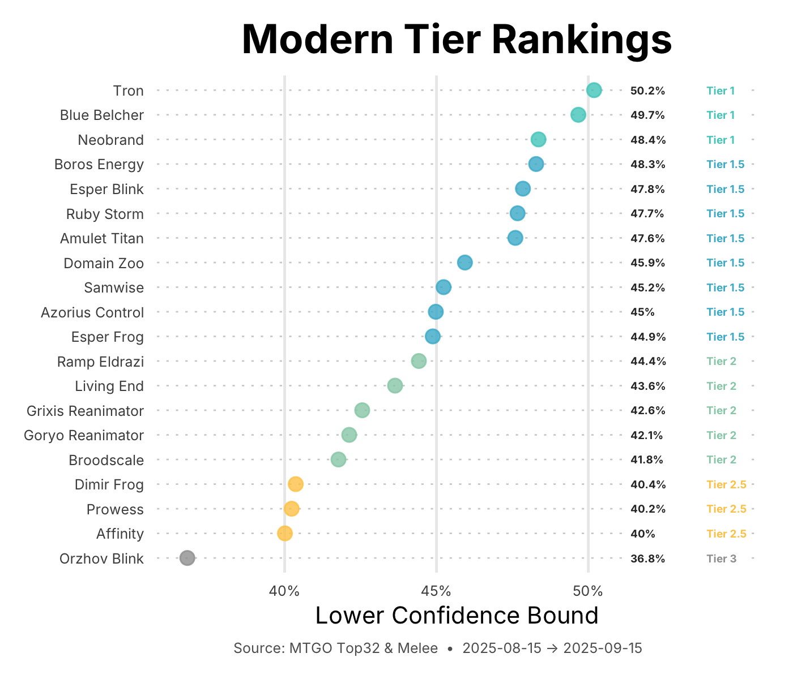
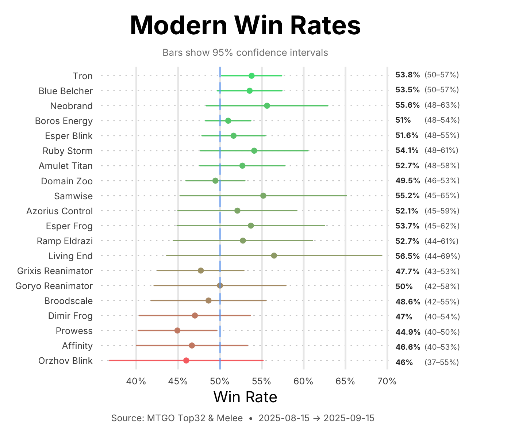

# How Are Magic Tiers Calculated? A Guide for Players

Ever wonder why your favorite deck is ranked where it is? Or how we decide if Tron is truly Tier 1 while Dimir Frog sits in Tier 2.5? Let's break down the math behind the tiers in a way that makes sense, even if your last math class was years ago.

## The Problem: Not All 53% Win Rates Are Equal

Imagine two Modern decks:
- **Domain Zoo**: 53% win rate over 2,000 matches
- **Some Brew**: 53% win rate over 20 matches

Both show the same win rate, but which one are you more confident in? Obviously Domain Zoo, because it has proven itself over many more games. The brew might have just gotten lucky (or unlucky) in its small sample.

This is the core challenge: **small sample sizes create uncertainty**. A deck that goes 11-9 (55% win rate) might actually be a 45% deck that got lucky, or a 65% deck that got unlucky. We just don't know yet.

## The Solution: Being Pessimistic (In a Good Way)

Instead of just using the raw win rate, we calculate what statisticians call a "confidence interval" - essentially asking: "Given what we've seen, what's the worst this deck's true win rate could reasonably be?"

Think of it like this: When evaluating a new deck at your LGS, you don't trust it after just one good night. You want to see it perform consistently over weeks. Our system does the same thing mathematically.

### The "Pessimistic Estimate"

For each archetype, we calculate:
1. **The observed win rate** (what actually happened)
2. **The confidence interval** (the range where the true win rate probably lies)
3. **The lower bound** (the pessimistic estimate - "it's at least this good")

We use this lower bound for tier rankings because it rewards both:
- High win rates
- Consistent performance over many matches

A deck with a 55% win rate over 1,000 matches might have a lower bound of 53%, while a deck with the same 55% win rate over just 50 matches might have a lower bound of only 41%. The first deck has proven itself; the second hasn't yet.

## How Tiers Are Calculated

Once we have the lower bound for each archetype, we look at how they compare to each other using standard deviations (basically, how spread out the values are):

### The Tier Boundaries

We calculate the average lower bound across all competitive archetypes, then assign tiers based on how far above or below average each deck is:

- **Tier 0.5**: Exceptional outliers (2-3 standard deviations above)  
- **Tier 1**: Strong (1-2 standard deviations above)
- **Tier 1.5**: Average/Playable (within 1 standard deviation of average)
- **Tier 2**: Below average (1-2 standard deviations below)
- **Tier 2.5**: Weak (2-3 standard deviations below)

Archetypes that would fall below Tier 3 are filtered out as non-competitive.

## Visual Examples

### Modern Tier Rankings

In this Modern snapshot, you can see:
- **Tron** sits at Tier 1 with a 50.2% lower bound
- **Domain Zoo** and most Tier 1.5 decks cluster around 45-48%
- **Orzhov Blink** drops to Tier 3 at 36.8%

The X-axis shows the "Lower Confidence Bound" - our pessimistic estimate of each deck's true win rate.

### Win Rates with Confidence Intervals

This chart shows the full picture:
- The **dot** is the observed win rate
- The **horizontal line** shows the 95% confidence interval
- The wider the line, the more uncertainty (usually from fewer matches)

Notice how Neobrand has a wide interval (48-63%) while Boros Energy's is tighter (48-54%). This reflects Boros Energy having more match data, making us more confident in its rating.

### Connecting the Two Charts

Here's the key insight: **The tier rankings use the LEFT edge of each confidence interval bar**, not the center dot. 

Look at both charts:
- In the Win Rates chart, Tron's bar stretches from 50% to 57%, with the dot at 53.8%
- In the Tier Rankings chart, Tron is plotted at 50.2% - that's the LEFT edge of its confidence bar
- This 50.2% lower bound puts Tron in Tier 1

Why does this matter? Consider Neobrand:
- Its WIN RATE (the dot) is 55.6% - higher than Tron's 53.8%!
- But its LOWER BOUND is only 48.4% (the left edge of that wide bar)
- So despite a higher win rate, Neobrand ranks lower because we're less confident in its performance

This is why a deck with a great win rate but few matches might rank below a deck with a merely good win rate but thousands of matches. We rank by certainty, not just performance.

## Frequently Asked Questions

### "Why is my favorite deck only Tier 2?"
Remember, tiers reflect **statistical confidence**, not just raw power. A Tier 2 deck might be:
- Very strong but with limited data
- Solid but genuinely middle-of-the-pack
- Struggling in the current meta

As more data comes in, rankings can shift dramatically.

### "How much data do you need for accurate tiers?"
Generally:
- **100+ matches**: Basic reliability
- **500+ matches**: Good confidence  
- **1000+ matches**: Very reliable

Decks with fewer matches will have wider confidence intervals and often rank lower due to our pessimistic approach.

### "Why use the lower bound instead of the actual win rate?"
Using the actual win rate would overvalue lucky runs and small samples. The lower bound approach:
- Rewards consistent performance
- Penalizes uncertainty
- Prevents flash-in-the-pan decks from hitting Tier 0 after one good weekend

### "Do you account for player skill?"
Yes! We use "clustered standard errors" that account for player effects. If certain players consistently over or underperform with a deck, our confidence intervals widen to reflect that uncertainty. This prevents a few pros (or a few beginners) from skewing an archetype's rating.

### "How often do tiers update?"
We recalculate as new tournament data arrives. Major events can shift tiers, especially for less-played archetypes where every tournament matters.

## The Bottom Line

Our tier system tries to answer: **"How confident are we that this deck is actually good?"**

- High tiers = strong performance + lots of evidence
- Low tiers = weak performance OR insufficient evidence
- The system rewards consistency over lucky spikes

This approach isn't perfect, but it provides a statistically grounded way to rank decks that accounts for both performance and sample size. It's pessimistic by design - we'd rather underrate a deck temporarily than overrate it based on limited data.

Next time you see these rankings, remember: that lower confidence bound isn't just a number - it's our best conservative estimate of how good a deck really is, based on all available evidence.

---

*Data Source: MTGO Top 32 & Melee tournaments. Rankings update as new results arrive.*