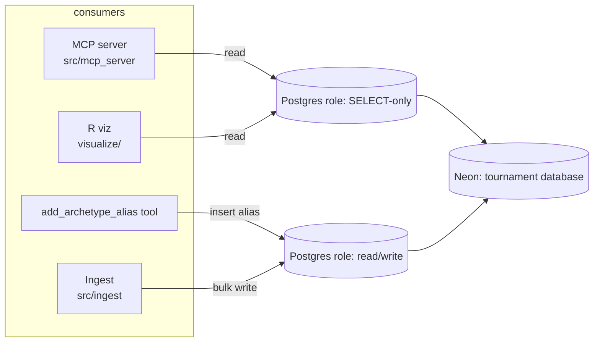

# feat: Migrate tournament DB to online Postgres (Neon)

## Summary

Move the tournament domain data off the local `data/tournament.db` SQLite file
onto Postgres in the existing Neon project, Postgres-only at runtime. Port the
tournament model layer, Alembic env, MCP read-only enforcement, ingest, and the R
visualization layer to Postgres by mirroring the dual-mode pattern already proven
for the Ops DB. Retire the local SQLite build. Read access moves to a `SELECT`-only
Postgres role; the single alias-write path uses a privileged role.

---

## Problem Frame

Tournament data (~4.6K tournaments, ~235K entries, ~1.1M matches, millions of
`deck_cards`, ~4.2 GB) lives only as a local SQLite file rebuilt by the weekly
ingest. Nothing beyond the maintainer's laptop can query it — the planned website
cannot be built on a local file, and there is no shared source of truth for agents
or third parties. The Ops DB already runs on Neon Postgres with a dual-mode engine
(`src/ops_model/base.py`), an Alembic env (`alembic/ops/env.py`), and a migration
guide (`docs/hidden_docs/POSTGRES_MIGRATION.md`); the tournament layer is the one
piece still SQLite-only. This is the "Online data backbone" track from
`STRATEGY.md` — nothing self-serve is possible until this data is online.

---

## Requirements Traceability

Origin requirements (see origin: `docs/brainstorms/2026-07-04-tournament-db-postgres-migration-requirements.md`):

- R1 (separate DB on Neon), R2 (right-size plan) → U6 backfill target + U8 docs; provisioning is operator work (Open Questions).
- R3 (Postgres schema, case-insensitive + fuzzy search) → **revised** — see KTD-1 (keep shim) and KTD-2 (trigram is net-new). U1, U4, U5.
- R4 (one-time backfill with row-count parity) → U6.
- R5, R6 (ingest writes to Postgres; bulk paths on direct connection) → U1, U7.
- R7 (retire local SQLite runtime path) → U1, U7, U8.
- R8 (MCP reads Postgres, `validate_select_only` retained) → U2.
- R9 (validate SQLite-dialect query logic) → U5, U7, U3 (R).
- R10 (R viz reads Postgres via RPostgres) → U3.
- R11 (read-only + write roles) → U2.
- R12 (credentials via env) → U1, U8.

---

## Key Technical Decisions

- KTD-1. **Keep the `CaseInsensitiveText` shim; do not switch to native `citext`.**
  The origin doc assumed native `citext` would replace the shim
  (`src/models/reference.py:25`). Research shows the shim force-lowercases on write
  while `citext` preserves case — a behavior change, not a rename. Downstream code
  depends on stored values already being lowercase (the R `lower(name)` joins in
  `visualize/db.R`; the archetype parser). The shim is dialect-agnostic and works on
  Postgres unchanged. Keeping it is zero-behavior-change and removes a data-integrity
  risk. Native `citext` becomes a deferred optional enhancement.

- KTD-2. **Fuzzy search targets parity first; real trigram indexing is optional
  follow-up.** The origin doc assumed `pg_trgm` was already configured. It is not —
  migration `69dd28a23263` created plain btree indexes only, and archetype fuzzy
  search uses a **SQLite FTS5** virtual table (`src/models/reference.py:215-219`)
  that has no Postgres equivalent. U5 makes player/archetype search work on Postgres
  as it does today (guard or replace FTS5-specific SQL); a real `pg_trgm` gin index
  is scoped as deferred.

- KTD-3. **Mirror the Ops DB dual-mode engine rather than inventing one.**
  `src/ops_model/base.py` already branches on a `postgresql://` URL for pool config
  vs SQLite PRAGMA listeners, and `alembic/ops/env.py` already branches on
  `is_sqlite`. Port these shapes verbatim into `src/models/base.py` and
  `alembic/env.py`. A distinct env var — `TOURNAMENT_DATABASE_URL` — selects the
  tournament Postgres, kept separate from Ops' `POSTGRES_URL` because it is a
  separate database (see origin Key Decision on separate-database boundary).

- KTD-4. **Read-only enforcement moves from PRAGMA to a Postgres role.** The MCP
  server's `_set_ro_pragmas` connect-listener (`PRAGMA query_only=ON`,
  `src/mcp_server/utils.py:43`) has no Postgres equivalent and errors on Postgres.
  Read consumers connect as a `SELECT`-only role; the two-engine split
  (`get_engine` read vs `get_alias_write_engine` write) is preserved by role, not by
  PRAGMA presence. `validate_select_only` is retained as defense-in-depth (R8).

- KTD-5. **Schema via Alembic, data via batched bulk load.** The existing
  `scripts/migrate_to_postgres.py` uses `Base.metadata.create_all` + per-row
  `session.add` — it bypasses Alembic (conflicts R3) and will not scale to ~1.1M
  matches (conflicts R6). The tournament backfill runs `alembic upgrade head` against
  Postgres for schema, then loads data in FK-dependency order via chunked
  `bulk_insert_mappings` over a direct (non-pooled) connection, keeping a row-count
  parity check.

---

## High-Level Technical Design

Consumer → role → database after migration:



Engine selection (mirrors `src/ops_model/base.py`):

```
_build_database_url():
  if TOURNAMENT_DATABASE_URL set -> return it        # postgresql://...?sslmode=require
  else -> sqlite:///<TOURNAMENT_DB_PATH or data/tournament.db>   # dev fallback

get_engine() / get_alias_write_engine():
  if url startswith "postgresql://":
     Postgres pool config (pool_pre_ping, pool_recycle=3600, pool_size, max_overflow)
     NO sqlite pragma listener
  else:
     existing SQLite pragma listener (WAL, foreign_keys, ...)
```

*Directional guidance, not implementation specification.*

---

## Implementation Units

### U1. Dual-mode engine in the tournament model layer

**Goal:** `src/models/base.py` selects Postgres or SQLite from `TOURNAMENT_DATABASE_URL`, applying Postgres pool config or SQLite PRAGMA listeners accordingly — for both the read engine and the alias-write engine.

**Requirements:** R3, R5, R6, R7, R12. **Dependencies:** none.

**Files:** `src/models/base.py`, `src/models/__init__.py` (if exports change), `tests/test_models_engine.py` (new).

**Approach:** Port `_build_ops_database_url` / `get_ops_engine` shape from `src/ops_model/base.py`. Add `_build_database_url` Postgres branch (env var first, SQLite fallback). Guard the two `set_sqlite_pragma` event listeners in `get_engine` and `get_alias_write_engine` so they only attach for SQLite URLs. Drop or repurpose the unused module-level `DATABASE_URL` constant. Keep `TOURNAMENT_DB_PATH` working for the SQLite dev fallback. **Normalize the scheme:** the Ops template matches only `postgresql://`, so a Neon-emitted `postgres://` URL would silently fall through to SQLite — normalize `postgres://` → `postgresql://` before the dialect test. `psycopg2-binary` is already a dependency (`pyproject.toml`), so no new install.

**Patterns to follow:** `src/ops_model/base.py:40-104` (URL builder + dialect-branched engine).

**Test scenarios:**
- With `TOURNAMENT_DATABASE_URL=postgresql://...`, `_build_database_url` returns it verbatim and `get_engine` builds a Postgres engine with no PRAGMA listener registered.
- With the var unset, `_build_database_url` returns a `sqlite:///` URL honoring `TOURNAMENT_DB_PATH`, and the SQLite PRAGMA listener still attaches.
- `get_alias_write_engine` follows the same dialect branch as `get_engine`.
- Edge: malformed/empty `TOURNAMENT_DATABASE_URL` falls back to SQLite rather than raising.

**Verification:** Unit tests pass against both URL shapes; a smoke connection to a Postgres URL issues `SELECT 1` with no PRAGMA error.

---

### U2. Postgres-aware read-only enforcement in the MCP server

**Goal:** MCP read path works on Postgres, enforcing read-only via role rather than `PRAGMA query_only`, while retaining `validate_select_only`.

**Requirements:** R8, R11, R9. **Dependencies:** U1.

**Files:** `src/mcp_server/utils.py`, `tests/test_mcp_ro.py` (extend/new).

**Approach:** Guard the `_set_ro_pragmas` listener (`src/mcp_server/utils.py:43-47`) so it attaches only for SQLite engines. On Postgres, read-only is guaranteed by connecting `get_engine()` as the `SELECT`-only role (U1 + role provisioning below), optionally reinforced by a `SET default_transaction_read_only = on` connect listener for defense-in-depth. Leave `validate_select_only` and the alias-insert allowlist unchanged. Confirm the `add_archetype_alias` write path routes through the RW-role engine (`get_alias_write_engine`). Note: the `mode=ro` mentioned in several docstrings was never actually applied to the SQLite URL — read-only has always relied on the PRAGMA + SQL gate, so nothing is lost by dropping the PRAGMA on Postgres.

**Patterns to follow:** existing SQLite/Postgres branch style from `src/ops_model/base.py`.

**Test scenarios:**
- On a Postgres engine, no `PRAGMA` statement is emitted at connect (no error).
- `validate_select_only` still rejects `INSERT`/`UPDATE`/`DROP`/multi-statement/`PRAGMA` inputs (dialect-agnostic — unchanged behavior).
- A read query issued through the `SELECT`-only role against a write statement fails at the DB level (role denies), proving defense-in-depth.
- Alias insert succeeds only through the RW engine.

**Verification:** MCP query tools return rows against Postgres; a direct write attempt on the read engine is denied by the role.

---

### U3. Read-only and read/write Postgres roles

**Goal:** Two least-privilege roles exist and each consumer uses the correct one.

**Requirements:** R11, R12. **Dependencies:** U1.

**Files:** `scripts/setup_pg_roles.sql` (new) or a documented snippet, `docs/hidden_docs/POSTGRES_MIGRATION.md` (extend), consumer connection-string wiring in `src/mcp_server/utils.py` / env.

**Approach:** Define a `SELECT`-only role (MCP reads, R viz) and a read/write role (ingest, alias writes, Alembic). Provisioning runs against Neon by the operator; the plan supplies the SQL and documents which env var each consumer reads. Wire `TOURNAMENT_DATABASE_URL` (read role) and a separate write URL (e.g. `TOURNAMENT_DATABASE_WRITE_URL`) so the alias-write and ingest paths select the RW role.

**Test scenarios:** `Test expectation: none — role provisioning is operator SQL + config; behavior is exercised via U2/U7 tests.` Document a manual verification: RO role `INSERT` is rejected; RW role `INSERT` succeeds.

**Verification:** `\du`-equivalent shows both roles with expected grants; MCP connects RO, ingest connects RW.

---

### U4. Alembic env targets Postgres

**Goal:** `alembic upgrade head` runs against the tournament Postgres when `TOURNAMENT_DATABASE_URL` is set, and `render_as_batch` no longer forces SQLite batch mode on Postgres.

**Requirements:** R3, R4. **Dependencies:** U1.

**Files:** `alembic/env.py`, `alembic.ini` (the hardcoded `sqlalchemy.url = sqlite:///data/tournament.db`), `alembic/versions/` (only if a migration proves SQLite-specific).

**Approach:** Mirror `alembic/ops/env.py`: add `load_dotenv()` (the tournament env lacks it today), import `_build_database_url` from `models.base`, use it for both offline and online URL selection, and set `is_sqlite = not url.startswith("postgresql://")` to make `render_as_batch=True` SQLite-only. Neutralize the hardcoded `sqlalchemy.url = sqlite:///data/tournament.db` at `alembic.ini:87`. Verify each existing migration in `alembic/versions/` applies cleanly on empty Postgres (batch-mode `op.batch_alter_table` blocks and any `sqlite`-guarded DDL are the audit targets).

**Enum handling (decide during this unit):** four columns use `Enum(...)` — `MatchResult`, `TournamentSource`, `BoardType`, `ChangeType`. On SQLite these are CHECK-constrained VARCHARs; on Postgres SQLAlchemy will emit native `CREATE TYPE`. Choose native PG enums (cleaner) vs `VARCHAR` + CHECK (exact parity with today's stored `WIN`/`LOSS`/`MTGO`/… strings, and no `CREATE TYPE` in autogenerate). Whichever is chosen, the backfill (U6) must write values the target column accepts.

**Patterns to follow:** `alembic/ops/env.py:50-77`.

**Test scenarios:**
- `alembic upgrade head` against an empty Postgres database creates all tournament tables and stamps head (integration, run against a throwaway Neon branch).
- With `TOURNAMENT_DATABASE_URL` unset, Alembic still targets the SQLite file (dev unchanged).
- Edge: a migration using `render_as_batch` does not error on Postgres once batch mode is gated.

**Verification:** `alembic current` reports head on Postgres; `\dt`-equivalent lists the expected tables and indexes.

---

### U5. Fuzzy-search and dialect-query parity on Postgres

**Goal:** Player and archetype search behave on Postgres as they do on SQLite; SQLite-only constructs (FTS5, date-string comparisons) are guarded or replaced.

**Requirements:** R3, R9. **Dependencies:** U4.

**Files:** `src/models/reference.py` (FTS5 virtual-table note), `src/mcp_server/player.py`, `src/mcp_server/archetype.py`, `src/mcp_server/search_card.py`, ingest FTS-population sites (discovered), `tests/test_search_parity.py` (new).

**Approach:** Enumerate actual fuzzy-search call sites (grep `fts`, `MATCH`, `archetype_fts`, `similarity`, `strftime`). For each SQLite-only construct, provide a Postgres path — an `ILIKE`/normalized-column query at minimum for parity. Keep the SQLite path behind the dialect branch so dev still works. Real `pg_trgm` gin indexing is deferred (KTD-2).

**Execution note:** Start by characterizing current search behavior with a test capturing today's SQLite results for representative queries, then make Postgres match.

**Test scenarios:**
- Player handle partial-match returns the same expected player on Postgres and SQLite for a known fixture.
- Archetype name search returns expected archetypes on Postgres (no reliance on `archetype_fts`).
- Date-range queries (`t.date >= :start AND t.date <= :end`) return the same rows on both dialects for a fixed window (guards the TEXT-date vs timestamp difference).
- Edge: empty / no-match query returns empty, not an error, on Postgres.

**Verification:** Search MCP tools return correct results against Postgres; no `no such function` / FTS errors.

---

### U6. One-time tournament backfill script

**Goal:** A script loads the full current SQLite dataset into the Postgres schema, in FK order, with row-count parity verification.

**Requirements:** R4, R6, R1. **Dependencies:** U1, U4.

**Files:** `scripts/migrate_tournament_to_postgres.py` (new), `tests/test_backfill.py` (new, small-fixture).

**Approach:** Schema via `alembic upgrade head` on the target (not `create_all`). Read from SQLite; write to Postgres in dependency order (formats, sets, players, cards, card_colors, archetypes, archetype_aliases, meta_changes, tournaments, tournament_entries, deck_cards, matches) using chunked `bulk_insert_mappings` over a **direct, non-pooled** connection. Preserve existing UUID PKs verbatim. End with a per-table `COUNT(*)` parity check (mirror the verify step in `scripts/migrate_to_postgres.py:129-173`).

**Patterns to follow:** `scripts/migrate_to_postgres.py` structure (connection test → schema → transfer → verify), with batched inserts replacing per-row `session.add`.

**Test scenarios:**
- Backfill of a small multi-table SQLite fixture reproduces identical row counts per table on Postgres.
- FK integrity holds: a `matches` row's `entry_id`/`opponent_entry_id` resolve to migrated entries.
- Idempotency/guard: re-running against a non-empty target is refused or handled explicitly (no silent partial dupes).
- Edge: a table with zero rows transfers cleanly.

**Verification:** Parity check prints all-green; spot SELECTs on `matches`/`deck_cards` match SQLite for sampled entries.

---

### U7. Ingest writes to Postgres; bulk-path performance

**Goal:** The weekly ingest writes to the tournament Postgres via the RW role and completes in an acceptable window despite remote round-trips.

**Requirements:** R5, R6, R7, R9. **Dependencies:** U1, U3.

**Files:** `src/ingest/ingest_tournament_data.py`, `src/ingest/ingest_matches.py`, `src/ingest/ingest_entries.py`, `tests/test_ingest_pg.py` (new/extend).

**Approach:** Point ingest at the RW engine (swapping the tournament engine to dual-mode routes ingest to Postgres automatically — no per-call changes). Address the chatty per-row patterns that turn into network round-trips on remote Postgres: `_pairing_already_present` runs a SELECT per matchup (`src/ingest/ingest_matches.py:20-35`) and `_recompute_wld_for_tournament` runs three `COUNT`s per entry (`:38-66`). The two highest-volume insert paths are `upsert_deck_cards_for_entry` (`src/ingest/ingest_entries.py:284`, per-card `session.add`) and the bidirectional `Match` inserts (`src/ingest/ingest_matches.py:185-186`) — convert these to `bulk_insert_mappings`/`bulk_save_objects`. Reduce round-trips — e.g. batch existence checks per tournament and compute W/L/D with grouped aggregate queries — so a full run is tolerable. Ingest has no SQLite-specific SQL today (no `INSERT OR REPLACE`/`strftime` in the write path); confirm during implementation.

**Execution note:** Add a characterization test on a fixture tournament (row counts + recomputed W/L/D) before changing the recompute/existence logic, to prove behavior is preserved.

**Test scenarios:**
- Ingesting a fixture tournament into Postgres yields the same tournaments/entries/deck_cards/matches counts as the SQLite path.
- W/L/D recompute produces identical per-entry values after the query rework.
- Duplicate-pairing suppression still holds (re-ingesting the same tournament creates no duplicate `matches`).
- Edge: an entry with no matchups ingests without error.

**Verification:** A real weekly-shaped ingest into a Neon branch completes without dialect errors and within an acceptable time; counts match the SQLite baseline.

---

### U8. R visualization on RPostgres

**Goal:** `visualize/` connects to Postgres via the read-only role and the monthly graphs render identically from the new source.

**Requirements:** R10, R9. **Dependencies:** U6.

**Files:** `visualize/db.R`, `visualize/params.R`, `visualize/run.R`, `visualize/get_marav.R`, `visualize/get_rolling_months.R` (connection call sites).

**Approach:** Swap `RSQLite::SQLite()` → `RPostgres::Postgres()` in `connect_db` (`visualize/db.R:11-16`), read connection params from env (host/db/user/password/port for the RO role), and drop the `file.exists` guard. Queries use `glue_sql(..., .con=con)` and are largely portable; validate the `t.date >=/<=` bound-parameter comparisons and the `lower(name)`/`str_to_title` handling against Postgres output.

**Test scenarios:** `Test expectation: characterization by output comparison — R lacks a unit harness here.` Compare a generated presence/WR/matrix figure (or its underlying data frame) for a fixed format+window against the pre-migration SQLite output; they must match.

**Verification:** `visualize/run.R` produces the monthly figures against Postgres with no driver/collation errors; a spot figure matches the SQLite baseline.

---

### U9. Config, docs, and codemaps

**Goal:** Environment, developer workflow, and architecture docs reflect the Postgres-only tournament layer.

**Requirements:** R7, R12. **Dependencies:** U1–U8.

**Files:** `.env.example` (add `TOURNAMENT_DATABASE_URL` / write URL), `docs/hidden_docs/POSTGRES_MIGRATION.md` (tournament section), `docs/CODEMAPS/architecture.md`, `docs/CODEMAPS/data.md`, `README` (dev-DB workflow).

**Approach:** Document the new env vars, the RO/RW roles, and that dev runs against a Neon branch (or local Postgres) now that the SQLite runtime path is retired. Update the two codemaps (read-only hardening now role-based; tournament DB now Postgres). Note the SQLite dev fallback remains available via `TOURNAMENT_DB_PATH`.

**Test scenarios:** `Test expectation: none — documentation and config.`

**Verification:** A new contributor can follow the docs to connect to a Neon branch and run the MCP server + a viz.

---

## Scope Boundaries

**In scope:** tournament data on Neon Postgres; all existing consumers (MCP, ingest, R) working against it; read-only role; one-time backfill; Postgres-only runtime with a SQLite dev fallback.

**Deferred for later** (from origin):
- The website's read path (Prisma second datasource vs Python API vs direct SQL) — an explorer-track decision.
- Schema trimming / `matches` dedup — data moves as-is.

**Deferred to Follow-Up Work** (surfaced during planning):
- Native `citext` adoption (KTD-1) — only if a concrete need arises.
- Real `pg_trgm` gin trigram indexing for fuzzy search (KTD-2) — parity ships first.

**Outside this migration:** real-time/daily ingestion; Mastra agent rebuild; MCP server rewrite (all parked at the strategy level).

---

## Risks & Dependencies

- **Ingest performance on remote Postgres (high).** The per-row existence checks and per-entry `COUNT`s become network round-trips at ~1.1M-match scale. Mitigation: U7 query rework + direct connection; validate on a Neon branch before cutover.
- **FTS5 fuzzy search has no Postgres equivalent (medium).** Mitigation: U5 parity path (ILIKE/normalized), trigram deferred.
- **Neon extension availability (low-medium).** `CREATE EXTENSION` for any Postgres-only feature must be permitted on the Neon tier. Only needed if native `citext`/`pg_trgm` are later adopted; parity plan avoids it. Verify during U3/operator setup.
- **Alembic migrations authored for SQLite batch mode (medium).** `render_as_batch` and any `op.batch_alter_table` must apply on Postgres. Mitigation: U4 dialect gate + upgrade-head test on empty Postgres.
- **Native PG enum creation (medium).** The four `Enum(...)` columns make Alembic autogenerate want `CREATE TYPE` on Postgres, and native enums are harder to alter later. Mitigation: U4 decides native-enum vs `VARCHAR`+CHECK before `upgrade head`; backfill (U6) writes accepted values.
- **`CaseInsensitiveText` lowercase dependency (medium).** Preserved by KTD-1 (keep shim). Any future citext move must re-audit downstream `lower(name)` joins.
- **Operator prerequisites:** Neon project access, plan right-sizing (R2), role creation, and env-var distribution are operator steps outside code — tracked in Open Questions.

---

## Open Questions

**Resolve before/at cutover (operator):**
- Provision the tournament database + RO/RW roles on the existing Neon project; confirm connection strings and `?sslmode=require`.
- Right-size the Neon plan (R2) and confirm scale-to-zero for the ~$2–4/mo target.

**Deferred to implementation:**
- Exact fuzzy-search call-site inventory and the minimal parity query per site (U5) — enumerated once code is open.
- Whether the ingest W/L/D recompute is best done as grouped aggregates or a single pass (U7) — decided against real timings on a Neon branch.
- Optimal backfill chunk size / whether `COPY` beats `bulk_insert_mappings` for `deck_cards`/`matches` (U6) — tuned against real load time.

---

## Sources & Research

- Origin: `docs/brainstorms/2026-07-04-tournament-db-postgres-migration-requirements.md`.
- Mirror pattern: `src/ops_model/base.py` (dual-mode engine), `alembic/ops/env.py` (dialect-branched Alembic env).
- Read-only hardening being replaced: `src/mcp_server/utils.py:43-86`; `docs/CODEMAPS/architecture.md` (Read-only Hardening).
- Backfill template: `scripts/migrate_to_postgres.py` (Ops DB; per-row transfer — not reused verbatim, see KTD-5).
- Ops Neon migration guide: `docs/hidden_docs/POSTGRES_MIGRATION.md`.
- Corrections found in research: migration `69dd28a23263` creates btree-only indexes (no `pg_trgm`); `CaseInsensitiveText` shim (`src/models/reference.py:25`) force-lowercases (behavior differs from `citext`); FTS5 virtual table (`src/models/reference.py:215-219`) is SQLite-only.
- Ingest round-trip hotspots: `src/ingest/ingest_matches.py:20-66`.
- R connection surface: `visualize/db.R:11-16`.
