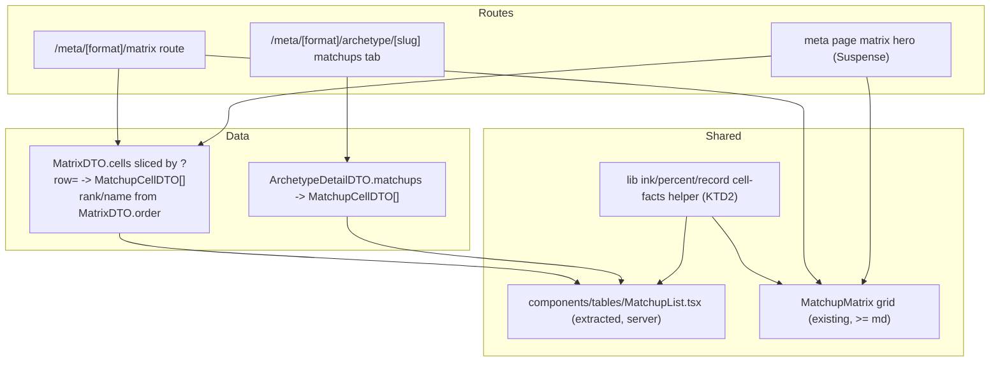

## Goal Capsule

- **Objective:** A competitive MTG player on a phone can reach every section, look up any archetype's matchups, and read win rates with confidence intervals — with no horizontal page scroll and no hover-only information — while desktop readers get a wider data measure, honest affordances, and passing contrast. Both themes keep the editorial identity.
- **Means:** One responsive codebase; a mobile-specific rendering only for the matchup matrix, sharing the extracted `MatchupList` component and the matrix's ink math (KTD1, KTD2, KTD3). The grid/list seam is its own media query (`matrix:` variant, KTD3), not the `md` breakpoint.
- **Authority:** Product behavior on R-IDs; implementation mechanism on KTD-IDs; units override neither.
- **Execution profile:** UI styling and component work — smoke-first verification (responsive browser pass) over unit coverage; logic tests only for URL-param round-trips (KTD8).
- **Stop conditions:** A required change forks the `MetaDataSource` contract or DTO shapes; a change cannot keep fixtures/postgres parity; the mobile grid seam cannot stay SSR-safe (KTD3).
- **Tail ownership:** Two datasource bugs (presence percent rendering, `FORMAT_ID_SQL` crash) are excluded here and travel via a separate ce-handoff; dead code from this refactor is removed in the units that create it.

---

## Product Contract

### Summary

Add the missing mobile layer to the web explorer and fix the design-audit findings in the same pass. The matchup matrix — the product's moat — gets a per-archetype matchup list wherever the grid seam (KTD3) is not met, reusing the archetype page's existing `MatchupList` shape and the matrix's confidence-as-ink math. Navigation, the LensBar, tables, charts, and tokens adapt via CSS. Desktop gains a wider data container, sticky ledger identity, and a token-level contrast fix. All view state stays in the URL.

### Problem Frame

The app ships zero mobile support: no breakpoints beyond a handful of `md:` classes, a header that cannot wrap, and a 12-column matrix with a ~870px minimum width. The audience checks matchups on phones at events, so the weakest surface is the one the core journey needs most. A live design audit (2026-09-27) also found desktop gaps: a 1120px ceiling on data-dense sections, tertiary text under the 4.5:1 contrast floor, a ledger whose archetype identity scrolls away, and a LensBar rendering inapplicable controls on the changes and tournaments routes.

### Requirements

**Mobile shell**

- R1. Every route's primary navigation is reachable at 360–480px viewport widths with no horizontal page scroll.
- R2. Header and LensBar interactive elements meet a 44px minimum touch target below the `md` breakpoint.

**Matchup surface**

- R3. The matrix route and the meta-page matrix hero render the grid only when the viewport is at least 880px wide **and** the primary input can hover with a fine pointer (`(hover: hover) and (pointer: fine)`); everywhere else — narrow viewports, landscape phones, touch tablets at or above 768px — they render the per-archetype matchup list. This seam is independent of the `md` breakpoint used by the rest of the shell.
- R4. The selected archetype of the mobile matchup list is carried in the URL, defaults to presence rank 1, and produces identical views when the link is shared.
- R5. Win rate, record, and the 95% confidence interval are readable inline on touch devices; no information is hover-only.
- R6. The grid/list variant seam is server-rendered and CSS-selected, so no hydration mismatch and no post-hydration layout swap occurs.

**Lens correctness**

- R7. The LensBar renders only controls that affect the current route: changes gets format and share; tournaments gets format, window, and share.
- R8. Every control that changes the view — including mobile-only controls — writes through the single URL-state path (`useMetaParams` → `params.ts`).
- R9. Focusable text inputs render at 16px or larger so iOS Safari does not auto-zoom.

**Desktop refinement**

- R10. Data-dense sections (matrix frame, ledger, scatter) render wider than the current 1120px ceiling; the container width is defined once.
- R11. Tertiary text (`ink-3` usage sites) reaches at least 4.5:1 contrast in both themes, fixed at the token layer in all four token-definition blocks.
- R12. The ledger keeps the archetype name visible during horizontal scroll (sticky column). Below `md`, `MetaTable` hides exactly the `tier` and `share` columns and folds the 95% CI inline beneath the win-rate value in the `wrlo` cell, so win rate, interval, record, and matches stay readable (R5). `CardAdoptionTable` hides its `Copies` column below `md` and keeps card name, `Decks`, and presence.
- R13. Existing desktop behavior, both themes, the editorial identity, and all current URL-param round-trips are preserved.
- R14. The 2026-09-27 design-audit polish items land in this pass: (a) the matrix mirror cell shows the muted em-dash instead of the near-invisible dot; (b) `KpiStat` labels never clip at 360px; (c) one `DeckTile` fits within 360px gutters; (d) matrix numbered column headers carry the archetype name as `aria-label`/`title`; (e) ledger archetype-name links show an explicit hover affordance; (f) horizontally scrollable tables show a right-edge scroll affordance.

### Success Criteria

- All five routes pass the 360px- and 390px-wide smoke passes in both themes: no horizontal page scroll, navigation reachable, content readable.
- A matchup lookup from landing to a chosen archetype's worst matchups completes in at most three taps on a phone.
- Cumulative layout shift measured with a `PerformanceObserver({ type: 'layout-shift', buffered: true })` snippet (or the DevTools Performance panel's CLS readout) reads 0.00 attributable to the variant seam on two surfaces: the matrix route on a cold load, and the meta page while the streamed matrix hero resolves. Any non-zero shift is traced to its source element and must not be the grid/list swap or the hero skeleton.
- `pnpm lint`, `pnpm test`, and a production build stay green.

### Scope Boundaries

- Two datasource bugs are out of scope: the card-adoption presence percent rendering (`CardAdoptionTable.tsx`) and the `FORMAT_ID_SQL` tournaments crash (diagnosed as stale webpack dev cache, no code fix expected). Both travel via ce-handoff.
- No changes to `MetaDataSource`, DTO shapes, SQL, fixtures data, or the ranking model.
- No component-test infrastructure (KTD8).
- No real-device lab; verification uses browser viewport emulation.

### Deferred to Follow-Up Work

- Sticky first column on the desktop matrix grid (fallback option if the grid itself ever goes touch-first).
- Bottom-bar mobile navigation, if the disclosure menu underperforms.
- Dead-code cleanup already present (`PresenceBars.tsx`, `TierChart.tsx`, unused `ui/` primitives) beyond what U2 touches.
- Highlighting the desktop grid row named by a shared `?row=` link, and linking mobile list rows to archetype pages the way grid headers do.

---

## Planning Contract

### Key Technical Decisions

- KTD1. **One responsive codebase; mobile-specific rendering only for the matchup matrix.** Chosen over a separate mobile design (the "make 2" proposal): two designs fork the editorial identity and double every future change for a solo maintainer, while a component-level seam yields the same dedicated-experience outcome. External precedent (FT, FiveThirtyEight, NYT) ships one responsive codebase with per-graphic mobile encodings; MTGGoldfish is the desktop-table counterexample. Decision reached through user-delegated advisor review; the user may still redirect. Governs the whole plan. Falsification trigger: if U2's list cannot complete the three-tap matchup lookup (Success Criteria) at 360px without a second mobile-only component beyond the archetype `Select`, KTD1 is reopened before U3–U6 start.
- KTD2. **Extract the archetype page's `MatchupList` into `components/tables/MatchupList.tsx` as the single matchup-list component, and share the matrix's cell math through one helper.** The matrix's `inkFill`/percent/record math moves to a shared lib module so grid and list render identical facts (§9-rule-5 math is never forked). Chosen over a new mobile-only component and over a `variant` prop on `MatchupMatrix`: the list consumes `MatchupCellDTO[]`: on the archetype page from `ArchetypeDetailDTO.matchups` directly, and on the matrix surfaces by slicing the selected archetype's cells out of `MatrixDTO.cells` (the full zero-filled grid) with rank and name taken from `MatrixDTO.order` — there is no `rows` field on `MatrixDTO`, and the archetype page already owns the right table shape.
- KTD3. **CSS-gated variant seam on a dedicated `matrix:` Tailwind variant: server-render both matrix variants, select with `hidden matrix:block` / `matrix:hidden`.** The variant is declared once in `globals.css` as `@custom-variant matrix (@media (min-width: 880px) and (hover: hover) and (pointer: fine))` — 880px clears the grid's own `minWidth = 200 + 12 × 56 = 872px` at the default `?n`, and the hover/pointer clause keeps touch tablets at or above 768px and landscape phones on the list, since the grid's CI is hover-only (R3, R5). Chosen over reusing `md` (hands touch devices a hover-dependent grid) and over `matchMedia`/client gating: JS gating re-renders the moat surface after hydration, risking mismatch and layout shift on a streamed Suspense hero. Accepted cost: the grid DOM ships in the mobile payload, bounded by the `?n` clamp (max 30 × 30 = 900 cells, default 12 × 12).
- KTD4. **`row` is a matrix-route extra in `params.ts`, mirroring `matrixTopN`, not a `MetaQuery` field.** `parseRow(sp, order)` reads `?row`, validates it with `isArchetypeSlug`, resolves it against the caller-supplied `MatrixDTO.order`, and falls back to presence rank 1 when absent or unknown; `buildHref` gains a `row` option in `BuildHrefOpts` that is omitted when it equals the rank-1 default. `params.ts` stays pure: it never fetches the order, the route passes it in — exactly how `parseMatrixTopN` / `matrixTopN` already work. "The URL is the state" (web/README.md). Chosen over adding `row` to `MetaQuery` (every shared URL on every route would then carry or re-derive a matrix-only value) and over component-local selector state, which would silently break shared links on mobile.
- KTD5. **Contrast is fixed at the token layer, in all four `globals.css` token blocks** (`:root` default, `prefers-color-scheme` media, `.dark`/`[data-theme='dark']`, `.light` re-assert). Chosen over per-site overrides across ~25 `ink-3` usage sites: the token is the design system's muted-metadata color, and a partial fix flips with the theme toggle.
- KTD6. **Column hiding uses CSS classes keyed by column id, mirroring `MetaTable`'s existing `RIGHT`/`SORTABLE` set pattern.** Chosen over TanStack column-visibility state: hiding is a pure CSS concern and needs no new client state.
- KTD7. **Container width rises to 1280px and is single-sourced.** The duplicated `max-w-[1120px] px-7` in `app/layout.tsx` and `Navbar.tsx` becomes one shared constant; prose-heavy sections may keep a narrower inner measure. Chosen over per-section break-out utilities, which drift.
- KTD8. **No component-test infrastructure is added.** The repo has zero component tests (vitest node environment, no jsdom/testing-library). URL-serialization logic gets vitest coverage; components are verified by responsive smoke passes. Chosen over adding testing-library in this plan: infrastructure adoption is its own decision, not a stowaway.

### High-Level Technical Design

The matchup surface converges on one list component fed by two DTO paths:

Variant selection per surface, CSS-gated (KTD3): grid renders `hidden matrix:block`, list renders `matrix:hidden`; both server-render from the same data in one pass. The `matrix:` variant is the one and only place the seam's media query is written.

Mobile treatment per remaining component:

| Component                                        | Mobile treatment                                                                                      |
| ------------------------------------------------ | ----------------------------------------------------------------------------------------------------- |
| `Navbar`                                         | Disclosure menu below `md`; 44px targets; searchParams readers stay inside `Suspense`                 |
| `LensBar`                                        | Per-route `variant` scoping (R7); wraps; 16px inputs; 44px targets                                    |
| `MetaTable`                                      | Sticky name column; hide `tier`,`share` below `md`; CI folded inline under win rate; scroll edge-fade |
| `CardAdoptionTable`                              | Sticky card-name column; hide `Copies` below `md`; scroll edge-fade                                   |
| `WrPresenceScatter` / `TrendChart` / `WrCiChart` | Reduced heights; stack fixed grids below `md`                                                         |
| `KpiStat` group                                  | Labels wrap without clipping at 360px                                                                 |
| `DeckTile` grid                                  | `minmax` capped so one tile fits 360px gutters                                                        |

### Assumptions

- KTD1 stands unless the user redirects at handoff; the advisor verdict was the user's requested evaluation channel.
- Tailwind default breakpoints (`md` = 768px) govern the shell, tables, and charts; the matrix grid/list seam uses the dedicated `matrix:` custom variant (KTD3). No `sm`-only designs.
- The grid's mobile DOM payload (bounded by the `?n` clamp at 30×30 = 900 cells, 144 at the default) is acceptable. If a measurement proves otherwise, the fallback is to re-open JS gating behind a server-rendered skeleton — the grid renders client-side only after `matchMedia` resolves, while the server ships a fixed-height skeleton in its place so R6's no-layout-shift guarantee holds. Code-splitting the grid is not a fallback: an SSR'd split still ships the bytes, and `ssr: false` reintroduces the post-hydration swap.
- The `FORMAT_ID_SQL` crash needs no code change (stale webpack dev cache; the symbol exists and is imported); a cold-start verification rides with the handoff, not this plan.

---

## Implementation Units

### U1. Responsive shell and mobile navigation

**Goal:** The header and layout container adapt to all widths; navigation is reachable on a phone.
**Requirements:** R1, R2, R10
**Dependencies:** none
**Files:**

- `web/src/app/layout.tsx`
- `web/src/components/Navbar.tsx`
- `web/src/components/ui/collapsible.tsx` (existing, unused — reference only)
- `web/src/lib/utils.ts` (existing: add the shared container constant next to `cn`, KTD7)

**Approach:**

1. Single-source the container as `max-w-[1280px] px-5 md:px-7` via one constant exported from `lib/utils.ts`; apply in `layout.tsx` and `Navbar.tsx` (KTD7).
2. Below `md`, collapse the four nav links into a disclosure button (menu icon) that toggles a panel reusing `NAV_ITEMS` and `navLinkClass`; Radix `collapsible.tsx` is present for this.
3. Keep any `useSearchParams`-reading piece inside the existing `Suspense` boundary pattern; replicate `ThemeToggle`'s mounted-guard for menu open state so SSR markup never mismatches.
4. Raise all header hit areas to 44px below `md` (`ThemeToggle` is currently 32px).
5. Keep the `wubrg-rule` hairline and gold active underline unchanged.

**Patterns to follow:** `Navbar.tsx` `NavLinks`/`NavLinksFallback` Suspense split; `ThemeToggle` mounted-guard; header-comment §9 citations.
**Test scenarios:**

- Test expectation: none — styling/component structure, covered by the smoke matrix in the Verification Contract.
  **Verification:** At 360px and 390px the header shows brand, menu button, and theme toggle; the menu opens, lists all four sections, preserves the lens in hrefs, and the page never scrolls horizontally.

### U2. Mobile matchup surface (list variant + `?row=` lens param)

**Goal:** The matrix route and meta hero render a per-archetype matchup list wherever the `matrix:` seam is not met, sharing one component and one cell-math source with the grid.
**Requirements:** R3, R4, R5, R6, R8
**Dependencies:** U1
**Files:**

- `web/src/components/tables/MatchupList.tsx` (new, extracted)
- `web/src/app/meta/[format]/archetype/[slug]/page.tsx` (extraction source; keep `?tab` contract)
- `web/src/lib/ink.ts` (new: `inkFill` + percent/record cell-facts helpers moved out of `MatchupMatrix.tsx`)
- `web/src/components/charts/MatchupMatrix.tsx` (consume `lib/ink.ts`; render CSS-gated variants)
- `web/src/app/meta/[format]/matrix/page.tsx`
- `web/src/app/meta/[format]/page.tsx` (hero Suspense boundary)
- `web/src/lib/params.ts` (`parseRow` + `BuildHrefOpts.row`, KTD4)
- `web/src/hooks/useMetaParams.ts` (selector write path; `useTransition` + `isPending`)
- `web/src/app/globals.css` (`@custom-variant matrix`, KTD3)
- `web/src/components/charts/MatrixSkeleton.tsx` (new: variant-mirroring streaming fallback)
- `web/src/components/ui/select.tsx` (existing, unused — archetype selector)
- `web/src/lib/params.test.ts` or `web/src/lib/__tests__/params.test.ts` (new, matching repo test layout)

**Approach:**

1. Move `inkFill` and the percent/record/CI formatting out of `MatchupMatrix.tsx` into `lib/ink.ts`; the grid imports it (KTD2). No behavior change in the grid.
2. Extract the archetype page's local `MatchupList` into `components/tables/MatchupList.tsx` as a server component taking `MatchupCellDTO[]`, a sort mode (`games` default, `wrAsc` for the matrix fallback), and optional CI inline text. The archetype page renders the extracted component with its current sort and filter.
3. Upgrade the extracted list: ink bar from the shared helper (confidence-as-ink per §9 rule 5), inline `47.4–55.7`-style CI text, and a one-line low-sample hint when most cells are `–` (reuses `LowSampleNotice`).
4. Add `parseRow(sp, order)` to `params.ts` beside `parseMatrixTopN`: read `?row`, require `isArchetypeSlug`, resolve against the `MatrixDTO.order` the route passes in, fall back to presence rank 1 when absent or unknown. Add `row` to `BuildHrefOpts`, omitted when it equals rank 1. `useMetaParams` reads the current value with `parseRow` the way it reads `parseMatrixTopN`, using the order it receives from the matrix surface (KTD4).
5. Declare `@custom-variant matrix (@media (min-width: 880px) and (hover: hover) and (pointer: fine))` in `globals.css` (KTD3). On the matrix route and meta hero, render the grid `hidden matrix:block` and the list `matrix:hidden` from the same `MatrixDTO` in one server pass; the list shows the selected archetype's cells sliced from `MatrixDTO.cells`, with an archetype `Select` that writes `row` through `useMetaParams` (KTD4, R8). The `Select` reads search params, so it sits in its own `Suspense` boundary with a static fallback, following the LensBar pattern.
6. Wrap the `router.push` in `useMetaParams` in `useTransition` and expose `isPending`; the list applies a reduced-opacity, `aria-busy` state to its rows while the RSC round-trip runs so a selector change is never a silent no-op on a slow connection.
7. Give the hero's streaming fallback the same variant seam as the content: a `MatrixSkeleton` that renders a list-shaped skeleton `matrix:hidden` and a grid-shaped skeleton `hidden matrix:block`, each sized to the default `?n` rows, so the reserved height matches whichever variant resolves and the Suspense resolve shifts nothing (R6).

**Patterns to follow:** archetype page `MatchupList` (`page.tsx` local, current sort/filter); `MatchupMatrix` tooltip content (becomes the list's inline CI); radix `Select` for the selector; `readTab`-style param validation for `row`.
**Test scenarios:**

- Happy path: `parseRow` resolves `?row=boros-dwarves` against a fixture order and `buildHref({ row })` reproduces it byte-identical alongside all existing params and `?n`.
- Edge: `?row=` with an unknown slug, a non-slug string, or a slug outside the current order falls back to presence rank 1 and is omitted on rebuild.
- Edge: `buildHref` with `row` equal to the rank-1 slug omits the param; `parseMetaQuery` output is unchanged by the presence of `?row=` (it is not a `MetaQuery` field).
- Edge: matrix order shorter than 2 rows renders the list without a selector.
- Integration: the archetype page's matchups tab renders the extracted component with unchanged ordering and CI tones (fixtures parity).
  **Verification:** At 360px and 390px the matrix route shows the list with rank-1 default, inline CIs, and working selector; at 768×1024 with touch emulation the list still renders; at 1440px with a mouse the grid is unchanged; a shared `?row=` link opens the same selection; view source shows both variants server-rendered; while a selector change is in flight the rows dim; the CLS reading (Success Criteria) is 0.00 on both the matrix route and the streamed hero.

### U3. LensBar per-route scoping and mobile form factor

**Goal:** The LensBar shows only controls that affect the current route, and its controls are touch- and iOS-safe.
**Requirements:** R2, R7, R8, R9
**Dependencies:** U1
**Files:**

- `web/src/components/LensBar/LensBar.tsx`
- `web/src/components/LensBar/KnobsPopover.tsx`
- `web/src/components/LensBar/WindowPicker.tsx`
- `web/src/components/LensBar/ArchetypeAdder.tsx` (13px search input, R9)
- `web/src/components/LensBar/styles.ts`
- `web/src/app/meta/[format]/changes/page.tsx`
- `web/src/app/meta/[format]/tournaments/page.tsx`
- `web/src/hooks/useMetaParams.ts`

**Approach:**

1. Extend the existing `variant` prop to `'meta' | 'matrix' | 'changes' | 'tournaments'`: changes renders `FormatPicker` + `ShareButton` only; tournaments adds `WindowPicker`; the knob popover and archetype adder hide where they are no-ops (R7).
2. Set 16px font on every text, search, number, and date input in the bar — `KnobsPopover` (13px mono), `WindowPicker` (13px mono), and `ArchetypeAdder` (13px search input) — so none stays below the iOS zoom threshold (R9); raise knob and chip hit areas to 44px below `md` (R2).
3. Pass `scroll: false` on same-path `router.push` patches in `useMetaParams` so knob changes do not teleport a mid-page mobile user; path-changing pushes keep default scroll. This is a deliberate desktop change too: a desktop knob change today scrolls to the top, and after this unit it holds position on every width.
4. Keep `ShareButton` aligned inside the first wrapped row of the bar instead of floating on its own row.

**Patterns to follow:** existing `variant='matrix'` gating in `KnobsPopover` — generalize it, do not add route-sniffing inside `LensBar`.
**Test scenarios:**

- Edge: `buildHref` for a changes-route share omits `start`/`end` when the window control is hidden (params still parse if hand-typed).
- Integration: switching format from the changes route keeps the path change and drops inapplicable params per the canonical clamps.
  **Verification:** On changes, only format chips and share render; on tournaments, no top-N/weight controls; at 390px, `getComputedStyle(el).fontSize` on every `input` and `select` inside the LensBar (including the archetype adder's search box) reads at least `16px`; a knob change mid-page does not scroll on either width.

### U4. Ledger and data tables mobile pass

**Goal:** `MetaTable` and `CardAdoptionTable` keep archetype identity visible and hide only the columns R12 names on narrow screens, keeping win rate, CI, and record readable.
**Requirements:** R5, R12, R13, R14(e), R14(f)
**Dependencies:** U1
**Files:**

- `web/src/components/tables/MetaTable.tsx`
- `web/src/components/tables/CardAdoptionTable.tsx`
- `web/src/app/meta/[format]/tournaments/page.tsx` (tournament table)

**Approach:**

1. In `MetaTable`, add a `HIDE_BELOW_MD` set keyed by column id containing exactly `tier` and `share`, applied as `hidden md:table-cell` on matching `th`/`td`, mirroring the `RIGHT`/`SORTABLE` set pattern (KTD6). Fold the 95% CI into the `wrlo` cell as a second line (`md:hidden`, the existing `text-[11.5px]` interval text) and hide the standalone `ci` column below `md` the same way, so the interval is rendered once at every width and `record` stays visible (R5, R12).
   1b. `CardAdoptionTable` has no column-id system: hide its `Copies` `th`/`td` pair below `md` with the same `hidden md:table-cell` utilities, keeping `#`, card name, `Decks`, and presence (R12).
2. Make the name column sticky: surface-token background, right hairline, z-index above scrolling cells, and layering that keeps the gold hover wash under the sticky cell.
3. Add a scroll affordance (right-edge fade via CSS mask) on `overflow-x-auto` table containers.
4. Give the archetype name link an explicit hover affordance (gold + underline) and a 44px-tall hit area below `md`; rows remain non-clickable (R14(e)).

**Patterns to follow:** `MetaTable` `RIGHT`/`SORTABLE` sets; `BucketBadge` pinned-row treatment.
**Test scenarios:**

- Edge: a bucket row (plain span, no link) stays readable and sticky-aligned while scrolled.
- Integration: sortable-header keyboard interaction (Enter/Space, `aria-sort`) works with hidden columns present.
  **Verification:** At 360px and 390px the ledger shows rank, name, win rate with the CI beneath it, record, and matches, with `tier` and `share` hidden; the card-adoption table shows card, decks, and presence with `Copies` hidden; the name stays pinned during horizontal scroll; sort indicators still work; desktop columns unchanged.

### U5. Contrast, tokens, and polish

**Goal:** Tertiary text passes 4.5:1 in both themes, fixed at the token layer; the R14 audit-polish items land.
**Requirements:** R11, R13, R14(a)–(d)
**Dependencies:** U2, U3, U4, U6 (so token-site verification covers settled components, including the three charts' `ink-3` sites)
**Files:**

- `web/src/app/globals.css`
- `web/src/components/charts/MatchupMatrix.tsx` (mirror-cell mark)
- `web/src/components/KpiStat.tsx`
- `web/src/components/DeckTile.tsx` (parent grid)

**Approach:**

1. Raise `--ink-3` toward the 4.5:1 floor against `--surface`/`--bg` in all four definition blocks — light and dark each, applied identically to `:root`, the media-query block, `.dark`, and `.light` (KTD5). Where a site is decorative-only (footers), leaving it is acceptable; label and table-header sites must pass.
2. Replace the near-invisible mirror-cell dot with the muted em-dash already used for low-sample cells (R14(a)).
3. Let `KpiStat` labels wrap or shrink tracking at 360px so `TOURNAMENTS` never clips (R14(b)).
4. Cap the `DeckTile` grid `minmax` so one tile fits within 360px gutters (R14(c)).
5. Add archetype-name `aria-label`/`title` to the matrix's numbered column headers to cut the legend lookup cost (R14(d)).

**Patterns to follow:** `globals.css` four-block token discipline; `LowSampleNotice` hedging voice.
**Test scenarios:**

- Test expectation: none — token/styling change, covered by the smoke matrix and a contrast spot-check.
  **Verification:** Contrast spot-check on table headers, KPI labels, and footers reads ≥4.5:1 in both themes; mirror cells show the em-dash; no clipped labels at 360px.

### U6. Charts mobile pass

**Goal:** Scatter, trend, and forest-plot charts fit narrow viewports without fixed-width overflow.
**Requirements:** R1, R13
**Dependencies:** U1
**Files:**

- `web/src/components/charts/WrPresenceScatter.tsx`
- `web/src/components/charts/TrendChart.tsx`
- `web/src/components/charts/WrCiChart.tsx`

**Approach:**

1. Reduce fixed chart heights below `md` (scatter 430→~300, trend 340→~260) and keep `ResponsiveContainer` widths honest inside the notch frames.
2. Stack `WrCiChart`'s `grid-cols-[190px_1fr]` to a single column below `md` with the label above the bar.
3. Keep the scatter's numbered legend readable (it already stacks via `grid-cols-1`); add vertical breathing room below `md`.

**Patterns to follow:** the scatter's existing `md:` grid split — the app's only responsive precedent.
**Test scenarios:**

- Test expectation: none — styling, covered by the smoke matrix.
  **Verification:** At 360px and 390px no chart overflows its frame; labels and legend stay readable; both themes unchanged.

---

## Verification Contract

| Gate                      | Command / method                                                                                                                                                                                                                                                                                       | Applies to             |
| ------------------------- | ------------------------------------------------------------------------------------------------------------------------------------------------------------------------------------------------------------------------------------------------------------------------------------------------------ | ---------------------- |
| Lint                      | `pnpm lint` (web/)                                                                                                                                                                                                                                                                                     | every unit             |
| Unit tests                | `pnpm test` (vitest) — existing suite plus new `params` round-trip tests                                                                                                                                                                                                                               | U2; regression for all |
| Types/build               | `pnpm build` (next build, webpack)                                                                                                                                                                                                                                                                     | final integration      |
| Format                    | `pnpm format:check`                                                                                                                                                                                                                                                                                    | final integration      |
| Responsive smoke matrix   | Browser emulation at 360×740, 390×844, 768×1024 (touch emulation on), 1440×900 (mouse) × light/dark × routes (meta, matrix, changes, tournaments, archetype): no horizontal page scroll; navigation reachable; R3–R9 behaviors observed; 360×740 is the R1 lower bound and is exercised on every route | every unit             |
| Input font-size assertion | At 360×740 and 390×844, `[...document.querySelectorAll('input, select, textarea')].every(el => parseFloat(getComputedStyle(el).fontSize) >= 16)` returns `true` on every route                                                                                                                         | U3                     |
| CLS reading               | `PerformanceObserver` on `layout-shift` (buffered) or DevTools Performance CLS on: matrix route cold load; meta page through hero streaming. Expected 0.00 from the seam                                                                                                                               | U2                     |
| Share-link round-trip     | Copy a mobile `?row=` URL into a fresh tab and confirm identical selection                                                                                                                                                                                                                             | U2, U3                 |
| Contrast spot-check       | Computed-color ratio on `ink-3` label sites in both themes                                                                                                                                                                                                                                             | U5                     |

## Definition of Done

- R1–R14 verified on the smoke matrix in both themes, with the grid visually unchanged at desktop widths.
- All gates in the Verification Contract pass.
- The extracted `MatchupList` has exactly one definition; the archetype page's local copy and the moved matrix math have no leftovers; no dead imports remain.
- The two handoff bugs remain untouched in this diff (presence rendering, `FORMAT_ID_SQL`).

---

## Sources / Research

- Advisor review (user-delegated, 2026-09-27): engineering + UX advisors independently chose the hybrid over a separate mobile design; the per-archetype "matchup strip" replaces the matrix on phones; desktop precedent FT/538/NYT, counterexample MTGGoldfish.
- `web/README.md` — "The URL is the state"; styled-to-the-spike (§9) convention; data-access firewall (`getDataSource()` only).
- `web/src/app/meta/[format]/archetype/[slug]/page.tsx` — local `MatchupList` (extraction source), `readTab` param validation, `pct1` ×100 precedent.
- `web/src/components/charts/MatchupMatrix.tsx` — `inkFill` (§9 rule 5), `rows` single-row prop, Radix CI tooltip, `minWidth = 200 + N*56`.
- `web/src/app/globals.css` — four-block token definitions; `--ink-3` ~3.3:1 light / ~3.9:1 dark today.
- Flow analysis gaps folded in: 44px targets, iOS 16px inputs, `scroll:false` knob patches, sticky-column layering, hero height reservation, low-sample hint.
- `docs/solutions/performance-issues/archetype-pages-correlated-subquery-latency.md` — fixtures/postgres parity discipline (relevant to the handoff bugs, not this plan's diff).
