# MCP Server

FastMCP server exposing read-only analysis tools over a SQLite tournament database.

## Run

### HTTP (used by included clients)

```bash
uv run -m src.mcp_server.server --http
```

Endpoint: `http://127.0.0.1:9000/mcp` (use `--host`/`--port` to customize)

### stdio (Claude Desktop)

```bash
uv run -m src.mcp_server.server --stdio
```

## Config

- `TOURNAMENT_DB_PATH` — path to `tournament.db` (default: `data/tournament.db`)
- **Read-only guard:**
  - SQLite `PRAGMA query_only=ON` per connection
  - Only `SELECT`/`WITH` queries allowed (validator blocks `PRAGMA`/`DDL`/`DML`/transactions)

## Tools (high level)

- `list_formats`, `get_format_meta_changes`
- `get_meta_report`, `get_archetype_overview`, `get_archetype_trends`
- `get_archetype_winrate`, `get_matchup_winrate`
- `get_card_presence`, `get_archetype_cards`
- `get_tournament_results`, `get_sources`
- `search_card`, `get_player`
- `query_database` (`SELECT`-only)

## Schema Quick Reference

**Main tables:**

- `formats`, `sets`, `players`, `cards`, `card_colors`, `archetypes`
- `tournaments`, `tournament_entries`, `deck_cards`, `matches`, `meta_changes`

**Important:** Avoid double-counting matches: use `entry_id < opponent_entry_id` or group by `pair_id`

### Database Schema Diagram



If you don't have the `tournament.db`, email: `valentinmanes@outlook.fr` for a prebuilt SQLite DB.
