# SocialBot (Bluesky)

## Overview

- Polls Bluesky notifications, triages which to answer, builds conversation context,
  runs the MCP-backed agent, summarizes to ≤300 chars, appends a session link, and replies
- Persists notifications, replies, and session linkage in the Ops DB

### SocialBot Flow Diagram



## Run

```bash
uv run -m src.socialbot.server
```

## Environment

- `BLUESKY_USERNAME`, `BLUESKY_PASSWORD` — account credentials
- `ANTHROPIC_API_KEY` — for the agent
- `NEXT_PUBLIC_SITE_URL` — used to build the per-session URL in replies
- `SOCIALBOT_POLL_INTERVAL` — seconds between polls (default 30)
- `SOCIALBOT_MAX_TO_PROCESS` — max pending notifications per cycle (default 1)
- `SOCIALBOT_MAX_TURNS`, `SOCIALBOT_CONTEXT_MAX_CHARS` — context limits
- `SOCIALBOT_TRIAGE=1|0` to enable/disable triage; `SOCIALBOT_FORCE_ANSWER=1` to force replies

## Notes

- Replies require valid parent/root StrongRefs (URI+CID)
- The agent reuses prior `session_id` for a thread when available to keep continuity

If you don't have the `tournament.db`, email: `valentinmanes@outlook.fr` for a prebuilt SQLite DB.
